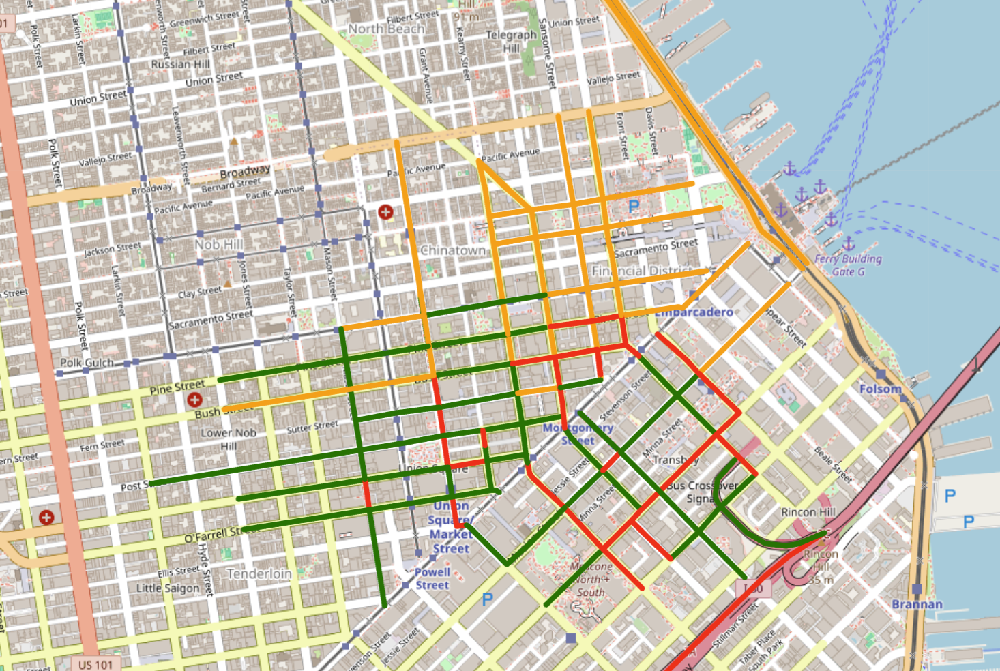
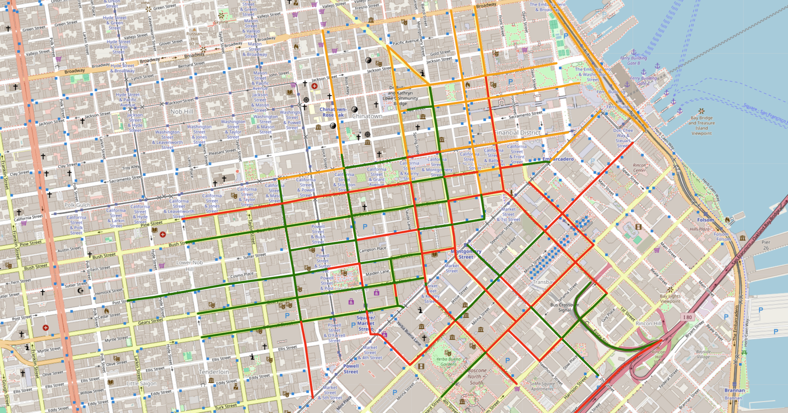

# California Traffic Spatial AI

**Spatial machine learning analysis of urban traffic congestion using real-time traffic data, OpenStreetMap, and unsupervised clustering.**

This project explores how geospatial data, machine learning, and large language models can be combined to detect and interpret urban traffic congestion patterns. Real-time traffic flow data from the HERE Traffic API was enriched with OpenStreetMap roadway information, transformed into congestion features, and analyzed using unsupervised machine learning.

The analysis focuses on **downtown San Francisco**, comparing traffic conditions during a Monday peak period and Sunday off-peak period.



## Overview

Traditional traffic analysis often relies on predefined thresholds or aggregate roadway statistics. This project explores a data-driven alternative using **unsupervised machine learning** to identify groups of roadway segments exhibiting similar traffic conditions.

The analytical pipeline combines:

* Real-time traffic flow data from the HERE Traffic API
* OpenStreetMap roadway classifications and network information
* Geospatial processing with GeoPandas and OSMnx
* Feature engineering based on traffic and roadway characteristics
* Unsupervised clustering with scikit-learn
* Interactive spatial visualization with Folium
* LLM-assisted interpretation of structured model outputs

The primary research question was:

> **Can lightweight spatial AI methods and prompt engineering help detect and interpret traffic congestion patterns in urban areas?**

## Project Workflow

```text
HERE Traffic API
        │
        ▼
Real-Time Traffic Flow Data
        │
        ▼
OpenStreetMap / OSMnx Enrichment
        │
        ▼
Geospatial Preprocessing
        │
        ▼
Feature Engineering
 ┌──────────────────────────┐
 │ Jam Factor               │
 │ Speed Ratio              │
 │ Road Classification      │
 │ Spatial Location         │
 └──────────────────────────┘
        │
        ▼
Feature Standardization
        │
        ▼
Unsupervised Machine Learning
        │
        ▼
K-Means Congestion Clusters
        │
        ▼
Spatial Visualization
        │
        ▼
Peak vs. Off-Peak Comparison
        │
        ▼
LLM-Assisted Interpretation
```

## Data Sources

### HERE Traffic API

Real-time traffic flow observations were retrieved using the HERE Traffic API. Traffic attributes used in the analysis included:

* **Current Speed** — observed roadway speed
* **Free-Flow Speed** — expected speed under uncongested conditions
* **Jam Factor** — HERE congestion indicator
* **Confidence** — confidence associated with the traffic observation
* **Road Geometry** — geographic representation of each traffic segment

A **speed ratio** was calculated to provide a normalized measure of roadway performance:

```text
Speed Ratio = Current Speed / Free-Flow Speed
```

Values closer to `1.0` indicate traffic operating near free-flow conditions, while lower values indicate increasing congestion.

### OpenStreetMap

Traffic segments were enriched using OpenStreetMap data accessed through OSMnx. OSM roadway classifications provided additional context about the functional characteristics of each segment, including secondary, tertiary, residential, busway, and other roadway types.

## Methods

### 1. Traffic Data Collection

Traffic flow data was collected for two temporal snapshots in downtown San Francisco:

| Period | Time    | Purpose             |
| ------ | ------- | ------------------- |
| Monday | 5:00 PM | Peak-period traffic |
| Sunday | 5:00 PM | Off-peak comparison |

Using multiple snapshots allowed the analysis to compare congestion behavior under different temporal conditions rather than relying on a single observation.

### 2. Feature Engineering

Traffic and roadway characteristics were transformed into features suitable for machine learning.

The primary features included:

* Jam Factor
* Speed Ratio
* Encoded OSM highway classification
* Geographic position of roadway segments

Features were standardized using `StandardScaler` before clustering to prevent differences in measurement scale from disproportionately influencing the model.

Traffic-related features were weighted more heavily than spatial characteristics so that observed roadway conditions remained the primary driver of clustering while geographic context was retained.

### 3. Clustering Model Evaluation

Two unsupervised clustering approaches were explored.

**DBSCAN** was initially evaluated because of its ability to identify spatially dense groups without requiring a predefined number of clusters. However, the resulting groups were not well suited to producing interpretable congestion categories for this dataset.

**K-Means** was selected for the final analysis because it produced clearer separation between roadway segments based on congestion characteristics.

Three clusters were generated and interpreted according to their average Jam Factor and Speed Ratio:

* **Congested**
* **Moderate Flow**
* **Free Flowing**

Because K-Means cluster IDs have no inherent meaning, cluster labels were assigned after examining the statistical characteristics of each group.

### 4. Spatial Visualization

Clustered roadway segments were visualized using Folium.

Standardized map symbology was used to distinguish congestion conditions:

* 🔴 Congested
* 🟠 Moderate Flow
* 🟢 Free Flowing

### Monday Peak Period


### Sunday Off-Peak Period



### 5. Traffic Aggregation

Clustered segments were aggregated at two levels:

**Road level** — used to identify individual streets exhibiting persistent or changing congestion.

**Road classification level** — used to compare congestion characteristics across OpenStreetMap roadway types.

Processed outputs are included in the [`data/processed`](data/processed/) directory.

## Results

The clustering analysis identified meaningful variation in traffic conditions between individual roadway segments and across the two observation periods.

Several corridors showed persistent congestion, while others exhibited substantial changes between Sunday and Monday. The analysis also revealed that assumed "peak" and "off-peak" periods did not always correspond with observed congestion: some downtown streets experienced greater congestion during the Sunday observation.

For example, the analysis identified persistent congestion around the **4th Street / 5th Street corridor**, with high Jam Factor values and comparatively low speed ratios during both observations. Other streets, including portions of **Bush Street, Market Street, and Pine Street**, exhibited substantial temporal variation.

These patterns demonstrate why real-time observations can provide information that broad peak-period assumptions alone may miss.

The clustering results also revealed limitations in the initial model. Some roadway groups received congestion labels that did not align perfectly with their average traffic metrics, illustrating the importance of validating unsupervised cluster interpretations rather than treating cluster assignments as predefined categories.

## LLM-Assisted Interpretation

A secondary component of the project explored whether an LLM could assist with interpretation after the geospatial and machine-learning analysis had been completed.

Structured outputs supplied to the model included:

* Segment-level congestion data
* Road-level congestion summaries
* Highway classification summaries
* Peak and off-peak map visualizations

Prompt variants were used to investigate temporal differences, persistent congestion, and potential transportation-planning implications.

The LLM was treated as an **interpretation layer rather than the analytical model itself**. Traffic measurements, feature engineering, and clustering were performed independently before model outputs were supplied for natural-language interpretation.

This experiment demonstrated how LLMs can complement traditional spatial analysis by helping summarize complex outputs while also emphasizing the need to validate generated interpretations against the underlying data.

## Technology Stack

| Category            | Technology             |
| ------------------- | ---------------------- |
| Language            | Python                 |
| Machine Learning    | scikit-learn           |
| Geospatial Analysis | GeoPandas, Shapely     |
| Street Network Data | OpenStreetMap, OSMnx   |
| Traffic Data        | HERE Traffic API       |
| Data Processing     | pandas, NumPy          |
| Visualization       | Folium                 |
| Environment         | Jupyter / Google Colab |

## Repository Structure

```text
california-traffic-spatial-ai/
│
├── README.md
├── LICENSE
├── requirements.txt
│
├── notebooks/
│   └── california_traffic_spatial_ai.ipynb
│
├── data/
│   └── processed/
│       ├── simplified_congestion_monday.csv
│       ├── simplified_congestion_sunday.csv
│       ├── road_congestion_summary_monday.csv
│       ├── road_congestion_summary_sunday.csv
│       ├── highway_type_summary_monday.csv
│       └── highway_type_summary_sunday.csv
│
├── images/
│   ├── folium_map_monday.png
│   └── folium_map_sunday.png
│
└── docs/
    └── final_report.pdf
```

## Running the Analysis

Clone the repository:

```bash
git clone https://github.com/YOUR-USERNAME/california-traffic-spatial-ai.git
cd california-traffic-spatial-ai
```

Install the required Python packages:

```bash
pip install -r requirements.txt
```

To retrieve new traffic observations, a HERE API key is required. Store the key as an environment variable rather than placing credentials directly in the notebook:

```bash
export HERE_API_KEY="your-api-key"
```

The included processed datasets allow the existing analytical results to be explored without API credentials.

Open:

```text
notebooks/california_traffic_spatial_ai.ipynb
```

to review the complete analysis.

## Limitations

This project represents an exploratory spatial AI workflow rather than a production traffic forecasting system.

Several limitations should be considered:

* The analysis compares two traffic snapshots rather than a long-term time series.
* Traffic conditions can be influenced by incidents, events, construction, weather, and other conditions not represented in the feature set.
* K-Means requires the number of clusters to be specified in advance.
* Cluster labels are interpretations of statistical groups rather than predefined traffic classifications.
* Geographic coordinates and encoded road classes can influence clustering depending on their weighting.
* LLM-generated interpretations require validation against the underlying analytical results.

## Future Improvements

Potential extensions include collecting traffic data across longer time periods, evaluating additional clustering algorithms, incorporating weather or event information, automating traffic-data ingestion, and developing predictive models for congestion forecasting.

The clustering workflow could also be improved by assigning congestion labels dynamically according to cluster-level traffic statistics rather than relying on fixed cluster IDs.

## Academic Context

This project was originally developed as part of **GEOG 582: Spatial AI** in Penn State University's Master of Science in Spatial Data Science program.

The repository has been organized to document the complete technical workflow, including data acquisition, geospatial preprocessing, machine learning, visualization, and model interpretation.
